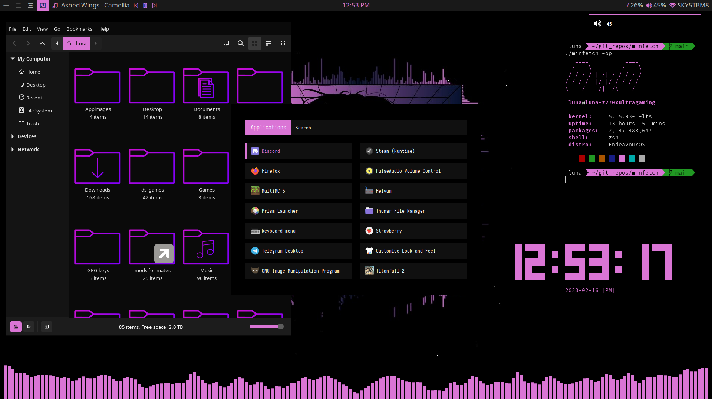

<h1 align="center">
Dotfiles
</h1>

this is just a place where i put all my config files to make them easier to share

<h2 align="center"> Programs </h2>

bar: polybar  
WM: i3  
term: kitty  
OS: EndeavourOS  
visualiser: glava  
editor: <a href="https://astronvim.github.io/">Astronvim</a>  
File manager: nemo  
fetchscript: <a href="https://github.com/xXTacticalWaffleXx/minfetch"> minfetch </a>  
<h2 align="center"> Pictures </h2>

